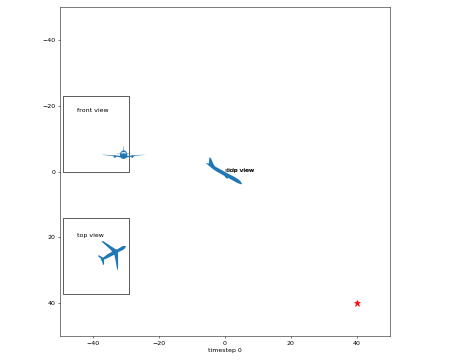

# gym_new_env



## Intro

This repo includes:
1. OpenAI Gym environment with some additional environments including
    1. inverted double pendulum: two-link pendulum with point masses m at the end of each link. Links are massless. Viscous friction with a coefficient c is assumed. Both links are actuated. This is a four dimensional dynamical system. [th1, th2, dth1, dth2]. Parameters include:
        -  `m`: mass of point masses (default value = 0.5 kg)
        -  `L`: length of each link (default value = 0.5 m)
        -  `c`: viscous friction coefficient (default value = 0.1 N.s)
        -  `g`: gravitational acceleration (default value = 9.8 m/s^2)
        -  `max_action`: maximum torque on each link (default value = 1000 N.m)
        -  `x_0`: initial position (default value = `[0.]*4`)
        -  `integration_method`: integration scheme, options are "1st" which is a first order euler update and "2nd"
                                 which is crank-nicolson update. 
        -  `dt`: timestep (default value = 0.001 s)
    2. inverted triple pendulum: three-link pendulum. parameters are similar to inverted double pendulum. 
    3. airplane: to be completed.
2. Conroller Implementation using LQR (linear–quadratic regulator) and ILQR (iterative linear–quadratic regulator) methods
3. Neural Network Controller: Training algorithm for designing neural network controller using behavior clonning.


## Installation
1. required libraries: `pickle`, `numpy`, `scipy`, `matplotlib`
2. From the top level directory, `gym_new_env`, run `pip install -e .`

## Usage
1. double pendulum
```
    env = make("Pendulum2-v0", dt=0.01)
    env.reset()
    for i in range(250):
        env.step([0., 0.]) # no torque
    env.render()
```   
2. controlling double pendulum using mixed ilqr and lqr:
    ```
    from gym.envs.registration import make
    from controler.util import ControllerDoublePendulum
    env = make("Pendulum2-v0", x_0=[1., 2., 0., -1.], dt=0.01) # initial position is [th1, th2, v1, v2]
    env.reset()
    control = ControllerDoublePendulum(env)
    n_step_lqr, n_step_ilqr = 250, 150
    Q = np.eye(4, 4)
    Q[1, 1] = 0
    Q[2, 2] = 0
    Qf = np.eye(4, 4) * 1000
    R = np.eye(2, 2)
    x_goal = [0., 0., 0., 0.]
    ilqr_actions = control.run_ilqr(Q, R, Qf, x_goal, n_step_ilqr)
    lqr_actions = control.run_lqr(Q, R, x_goal, n_step_lqr, ilqr_actions[-1])
    env.render() # or env.animate() to make a .gif file
    ```
3. controlling airplane using mixed ilqr and lqr with some intermediate way-points:
    ```
    import numpy as np
    from gym.envs.registration import make
    n_step_lqr, n_step_ilqr = 1500, 30
    Q = np.eye(12, 12) *10
    Qf = np.eye(12, 12) * 1000
    R = np.eye(6, 6)
    x_goal = [40., 0., 40., 0.,  0., 0., 0., .5, .5, 0., 0., 0.]
    x_0    = [0.,  0., 0.,  2.,  0., 0., .5, 0., 0., 0., 0., 0.]
    x_med  = [10., 0., 10., 0.,  0., 0., 0., 0., 0., 0., 0., 0.]
    env = make("AirPlane-v0", dt=0.01, x_0=x_0, g=1.)
    env.reset()
    from util import ControllerAirPlane
    control = ControllerAirPlane(env)
    ilqr_actions = control.run_ilqr(Q, R, Qf, x_med, n_step_ilqr)
    control.run_lqr(Q, R, x_goal, n_step_lqr, ilqr_actions[-1])
    env.render(skip=5)
    ```
